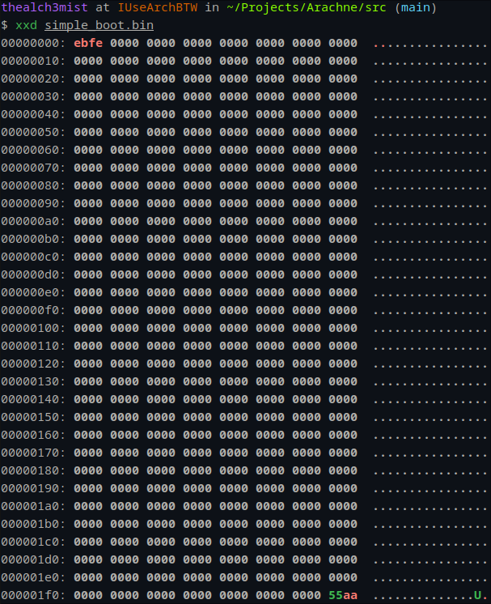

# The Bootloader
- The Bootloader is responsible for loading the operating system into memory.
- The Operating System needs to be stored into the first sector of the hard drive(<a href="https://en.wikipedia.org/wiki/Master_boot_record">Master Boot Record (MBR)</a>). 
- We need to install the bootloader when we install the operating system.

# Master Boot Record (MBR)
- The first sector of the disk we choose to install our OS on is the MBR and it contains the bootloader and the partition table.
- The partition table contains information about the partitions on the disk.
- The MBR is 512 bytes in size.
- The first 446 bytes are the bootloader.
- The next 64 bytes are the partition table.
- The last 2 bytes are the magic number (0x55, 0xAA) which indicates that the MBR is bootable.

```bash
[0---446 bytes] Bootloader
[446---510 bytes] Partition Table
[510---512 bytes] Magic Number
```
<p align="center">
  
</p>

