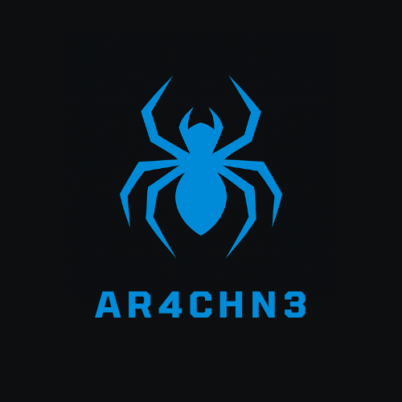

# Arachne OS 🕸️  
*A high-performance operating system for fast, concurrent systems.*

<div align="center">
    
</div>

---

## Table of Contents

- [About](#about)
- [Features](#features)
- [Technologies](#technologies)
- [Getting Started](#getting-started)
- [Project Layout](#project-layout)
- [Documentation](#documentation)
- [Contributing](#contributing)
- [License](#license)

---

## About

**Arachne** is a modular real-time operating system (RTOS) designed for AI-native workloads. It is built from scratch to support compiler-aware OS design and efficient on-device machine learning.

---

## Features

- Modular, preemptive kernel
- Deterministic task scheduling for real-time AI inference
- Compiler-aware runtime hooks
- Lightweight threading and message-passing
- Real-time memory management for concurrent workloads
- Simulated peripheral support (UART, timers, GPIO)


---

## Technologies

- Languages: C++, x86-64 Assembly
- Platform: Bare-metal, QEMU-compatible x86
- Build System: Make, NASM, LD
---

## Getting Started

### Requirements

- Cross-compiler toolchain for x86_64
- QEMU or real hardware (`qemu-system-x86_64`)
- `make`, `nasm`, `ld`, `gcc`, `grub-pc-bin`, `xorriso` 

### Build & Run

```bash
git clone https://github.com/harris2001/Arachne
make
vncviewer localhost:5900
```

## Project Layout

```plaintext
Arachne/
├── build/       # Build artifacts
├── devs/        # Developers setup (if you want to contribute) 
├── icons/       # Project icons and logos 
├── src/         # Source code
│   ├── impl/    # Architecture-specific code
│   │   └── x86_64/ # x86_64 implementation
│   └── common/  # Architecture-independent code
├── targets/     # Build targets and configurations
│   └── x86_64/  # x86_64 target configuration
├── kernel/      # Scheduler, memory, syscalls
├── drivers/     # Basic device drivers
├── libs/        # Standard libraries and helpers
├── user/        # User-space test programs
├── tests/       # Unit and integration tests
├── docs/        # Design documentation
├── Makefile     # Build script
└── README.md    # Project overview
```

## Documentation

Architecture notes and design documents are available in the `docs/` directory.

## Contributing
Contributions are welcome! Please fork the repository and submit a pull request. For larger changes, please open an issue first to discuss your ideas.

## License

This project is licensed under the MIT License.
